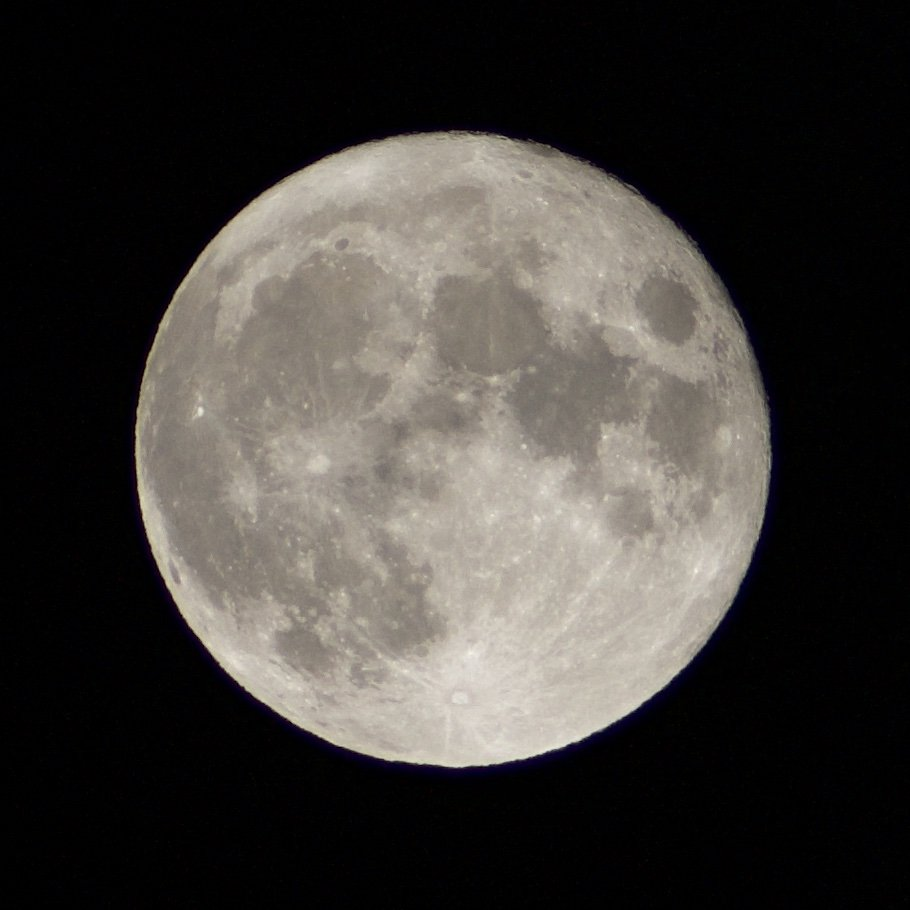

# moon

> 日本語のREADMEはこちらです: [README.ja.md](README.ja.md)

This repository provides open data of the 2021 Harvest Moon (Chūshū no Meigetsu), captured with a Nikon D90. The data is available in both processed JPEG and original RAW (`.NEF`) formats.

*Photo by [@taisukef](https://twitter.com/taisukef/status/1440307372480626696)*

## Data

The following files are available in this repository:

| File                       | Format        | Description             |
| -------------------------- | ------------- | ----------------------- |
| `moon-400m-20210921.jpg`   | JPEG          | Processed image         |
| `DSC_1740.NEF`             | Nikon D90 RAW | Original raw image data |
| `DSC_1777.NEF`             | Nikon D90 RAW | Original raw image data |

## Usage

Feel free to use these images for any purpose, including personal, educational, or commercial projects.

## License

License: [CC0 (Public Domain)](https://creativecommons.org/publicdomain/zero/1.0/)